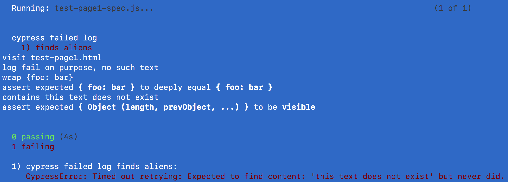

# cypress-failed-log 

> Shows the commands from [Cypress.io](https://www.cypress.io) failed test in the terminal.

[![NPM][npm-icon] ][npm-url]

[![ci status][ci image]][ci url]
[![semantic-release][semantic-image] ][semantic-url]
[![js-standard-style][standard-image]][standard-url]
[![renovate-app badge][renovate-badge]][renovate-app]

## Install

Add this module as a dev dependency to your project

```sh
npm install --save-dev cypress cypress-failed-log
# if using Yarn
yarn add -D cypress-failed-log
```

Then include this module from your [cypress/support/e2e.js](cypress/support/e2e.js) file

```js
// in your cypress/support/e2e.js
// or spec file
// https://github.com/bahmutov/cypress-failed-log
require('cypress-failed-log')
// you can use the "import" keyword
import "cypress-failed-log"
```

### Recommended for v10

```js
// cypress.config.js
const { defineConfig } = require('cypress')

module.exports = defineConfig({
  defaultCommandTimeout: 500,
  e2e: {
    setupNodeEvents(on, config) {
      // https://github.com/bahmutov/cypress-failed-log
      require('cypress-failed-log/on')(on)
    },
  },
})
```

When Cypress runs, you will see commands including the failed one, right in the terminal



## JSON file

In addition, all failed commands will be saved into a JSON file. The saved JSON file will live in `cypress/logs/` and have the following properties:

```
specName - filename of the spec
title - the name of the test
suiteName - the parent suite name
testName - full name of the test, including the suite name
testError - error message string
testCommands - array of strings, the last failing command is the last item
```

## Example

Here is the failed test JSON file contents. The test name, the failure
and each test command before the test are recorded

```json
{
  "specName": "failing-spec.js",
  "title": "loads the About tab",
  "suiteName": "Website",
  "testName": "Website loads the About tab",
  "testError": "Timed out retrying: Expected to find content: 'Join Us' but never did.",
  "testCommands": [
    "visit",
    "new url https://www.company.com/#/",
    "contains a.nav-link, About",
    "click",
    "new url https://www.company.com/#/about",
    "hash",
    "assert expected **#/about** to equal **#/about**",
    "contains Join Us",
    "assert expected **body :not(script):contains(**'Join Us'**), [type='submit'][value~='Join Us']** to exist in the DOM"
  ]
}
```

## Debugging

To turn on [`debug`](https://github.com/visionmedia/debug#readme) messages in the browser, open in Cypress browser DevTools console and enter `localStorage.debug = 'cypress-failed-log'`, then reload the spec. You should see log messages.

### Small print

Author: Gleb Bahmutov &lt;gleb.bahmutov@gmail.com&gt; &copy; 2017

- [@bahmutov](https://twitter.com/bahmutov)
- [glebbahmutov.com](https://glebbahmutov.com)
- [blog](https://glebbahmutov.com/blog)
- - [videos](https://www.youtube.com/glebbahmutov)
- [presentations](https://slides.com/bahmutov)
- [cypress.tips](https://cypress.tips)

License: MIT - do anything with the code, but don't blame me if it does not work.

Support: if you find any problems with this module, email / tweet /
[open issue](https://github.com/bahmutov/cypress-failed-log/issues) on Github

## MIT License

Copyright (c) 2017 Gleb Bahmutov &lt;gleb.bahmutov@gmail.com&gt;

Permission is hereby granted, free of charge, to any person
obtaining a copy of this software and associated documentation
files (the "Software"), to deal in the Software without
restriction, including without limitation the rights to use,
copy, modify, merge, publish, distribute, sublicense, and/or sell
copies of the Software, and to permit persons to whom the
Software is furnished to do so, subject to the following
conditions:

The above copyright notice and this permission notice shall be
included in all copies or substantial portions of the Software.

THE SOFTWARE IS PROVIDED "AS IS", WITHOUT WARRANTY OF ANY KIND,
EXPRESS OR IMPLIED, INCLUDING BUT NOT LIMITED TO THE WARRANTIES
OF MERCHANTABILITY, FITNESS FOR A PARTICULAR PURPOSE AND
NONINFRINGEMENT. IN NO EVENT SHALL THE AUTHORS OR COPYRIGHT
HOLDERS BE LIABLE FOR ANY CLAIM, DAMAGES OR OTHER LIABILITY,
WHETHER IN AN ACTION OF CONTRACT, TORT OR OTHERWISE, ARISING
FROM, OUT OF OR IN CONNECTION WITH THE SOFTWARE OR THE USE OR
OTHER DEALINGS IN THE SOFTWARE.

[npm-icon]: https://nodei.co/npm/cypress-failed-log.svg?downloads=true
[npm-url]: https://npmjs.org/package/cypress-failed-log
[semantic-image]: https://img.shields.io/badge/%20%20%F0%9F%93%A6%F0%9F%9A%80-semantic--release-e10079.svg
[semantic-url]: https://github.com/semantic-release/semantic-release
[standard-image]: https://img.shields.io/badge/code%20style-standard-brightgreen.svg
[standard-url]: http://standardjs.com/
[renovate-badge]: https://img.shields.io/badge/renovate-app-blue.svg
[renovate-app]: https://renovateapp.com/

[ci image]: https://github.com/bahmutov/cypress-failed-log/workflows/ci/badge.svg?branch=master
[ci url]: https://github.com/bahmutov/cypress-failed-log/actions
